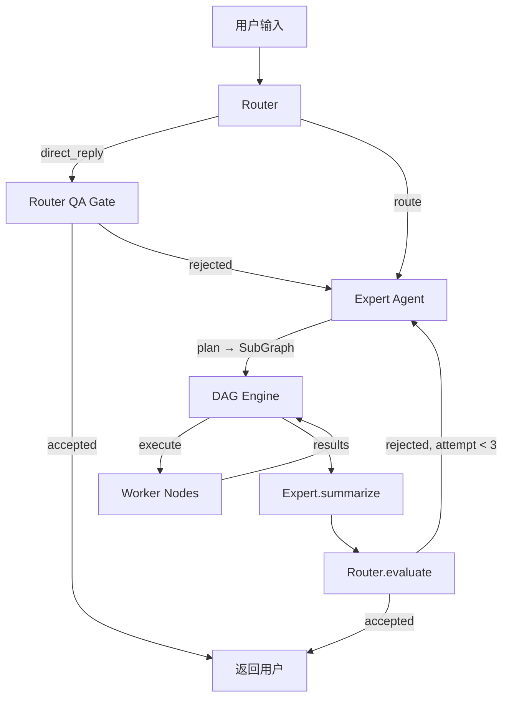

# Telos 架构深度分析（基于源码审计 2026-03-16）

本文档基于对所有核心源码的逐行审计，准确反映当前实际实现状态。

---

## 一、整体控制流 — 三层 Agent 架构



### Tier 1: Router Agent (router.rs, 356行)

**实际行为**：
1. 接收用户输入 + 会话历史 (session_logs) + 记忆上下文
2. **ReAct 工具循环** (max 3轮)：Router 可调用 `memory_read` 工具查询长期记忆
3. 输出三种决策：
   - `direct_reply` → 经 QA Gate 评估后直接返回
   - `route` → 分发到 Expert Agent (software/research/qa/general)
   - `tool` → 继续 ReAct 循环

**QA Gate** (`evaluate` 方法)：三维评估 `contains_answer` × `is_relevant` × `is_acceptable`，含 grounding override 逻辑（programmatic 强制约束）。

**⚠️ 现状问题**：
- Router 的 ReAct 循环**只支持 `memory_read` 一个工具**，不支持 web_search、fs_read 等
- QA Gate 是**独立 LLM 调用**，额外消耗 token 和延迟
- Router prompt 拼接方式是 format! 硬编码，未使用 PromptBuilder

### Tier 2: Expert Agents (实现 ExpertAgent trait)

| Expert | 文件 | 行数 | plan() 行为 | summarize() 行为 |
|--------|------|------|-------------|-----------------|
| ArchitectAgent | architect.rs | 191 | 单次 LLM 生成 SubGraph JSON | 串联所有子节点 output.text |
| GeneralAgent | general.rs | 269 | 工具发现 → LLM 生成 SubGraph | **Relevance Gate**: 先 LLM 分类相关性再合成 |
| DeepResearchAgent | researcher.rs | ~300 | 生成 SearchWorker SubGraph | 汇总搜索结果 |
| TestingAgent | tester.rs | ~200 | 生成测试计划 SubGraph | 汇总测试结果 |

**关键发现**：
- `ArchitectAgent.plan()` 和 `GeneralAgent.plan()` **都是单次 LLM 调用**，没有多轮规划
- Expert 的 `plan()` 直接在 `execute()` 中被调用，返回 `AgentOutput::with_subgraph()` 由 DAG engine 注入子图
- GeneralAgent 的 `summarize()` 有一个 **Relevance Gate**（额外 LLM 调用分类每个结果的相关性），这是一个好的质量兜底

### Tier 3: Worker Agents (实现 WorkerAgent trait 或直接实现 ExecutableNode)

| Worker | 文件 | 行数 | 核心行为 |
|--------|------|------|---------|
| CoderAgent | coder.rs | 160 | LLM 生成代码/Rhai 脚本；stuck 检测 (max 3次) + Expert consultation |
| SearchWorkerAgent | search_worker.rs | 513 | 多阶段搜索：query 工程 → 多查询 → URL 去重 → 自动 scrape → 质量评估 |
| ReviewAgent | reviewer.rs | ~150 | 代码审查 |
| LlmPromptNode | main.rs:201 | 简单 LLM 调用包装 |
| ToolNode | main.rs:269 | 直接执行注册工具 |

---

## 二、DAG Engine 现状 (engine.rs, 839行)

### 核心执行逻辑

```
Kahn's算法 → FuturesUnordered 并行执行 → 结果分发 → 入度减少 → 就绪队列
```

### 已实现的功能

| 功能 | 状态 | 说明 |
|------|------|------|
| 并行节点执行 | ✅ | FuturesUnordered，真并发 |
| 动态 SubGraph 注入 | ✅ | Expert 返回 sub_graph → engine 动态添加节点/边 |
| 纠正循环 (LoopState) | ✅ | Actor-Critic 模式，stagnation 检测 (Δ<0.05)，best_output 追踪 |
| 熔断器 | ✅ | 失败率 > 50% 或致命错误触发熔断 |
| SubGraph 深度限制 | ✅ | max_depth=5, max_total_nodes=50 |
| WaitingForInput | ✅ | 节点可暂停等待用户输入，通过 wakeup channel 恢复 |
| 进度追踪 | ✅ | ActiveTaskRegistry + ProgressInfo 实时推送 |

### ⚠️ 关键缺陷

1. **Agent 没有 ReAct 工具循环**: Worker 节点（如 CoderAgent）是"一次性 LLM 调用"，不能在执行中调用工具。Coder 调用一次 LLM 拿到代码就结束了，**不会实际执行代码、检查编译错误、再修正**。

2. **没有工具调用机制**: 当前系统中，Agent 调用工具的方式是：Expert 在 plan() 中生成包含 `agent_type: "tool"` 节点的 SubGraph，每个工具调用变成一个 DAG 节点。这意味着 **Agent 无法在一次交互中做"调用工具→看结果→决策→再调用工具"的循环**。

3. **Coder 不真正执行代码**: CoderAgent 只是让 LLM 生成代码文本返回，**没有调用 shell_exec、file_edit、fs_write 等工具**来实际写文件或编译。

4. **超长任务无法自动化**: 没有 checkpoint/hydration 机制。DAG 执行是内存中的一次性过程，如果 daemon 重启，所有进度丢失。

---

## 三、代码工具现状 (native.rs, 1558行)

### 已注册的 15 个 Native Tools

| # | 工具名 | 类型 | 关键实现 | 问题 |
|---|--------|------|---------|------|
| 1 | `fs_read` | 文件 | `fs::read_to_string` | ✅ 正常 |
| 2 | `fs_write` | 文件 | `fs::write` | ⚠️ 无备份，直接覆盖 |
| 3 | `shell_exec` | 系统 | `sh -c` | ⚠️ 无超时限制，无权限检查 |
| 4 | `calculator` | 计算 | 手写递归下降解析器 | ✅ |
| 5 | `tool_register` | 元工具 | 注册 Wasm/Rhai 脚本 | ✅ |
| 6 | `memory_recall` | 记忆 | EntityLookup 查询 | ✅ |
| 7 | `memory_store` | 记忆 | 存储 Semantic 记忆 | ✅ |
| 8 | **`file_edit`** | 文件 | **精确字符串匹配** `content.contains(search)` | 🔴 **无模糊匹配** |
| 9 | `glob` | 搜索 | `find . -name` | ⚠️ 只在当前目录 |
| 10 | `grep` | 搜索 | `grep -rn` | ✅ |
| 11 | `http_get` | 网络 | `reqwest::get` | ⚠️ 无超时，无代理 |
| 12 | `web_search` | 搜索 | Bing/DuckDuckGo/Google API | ✅ 多引擎fallback |
| 13 | `web_scrape` | 网络 | `scraper` + readability | ✅ 含代理/超时 |
| 14 | `get_time` | 系统 | chrono | ✅ |
| 15 | `lsp_symbol_search` | 代码 | **grep -rnE 模拟** | 🔴 **不是真正 LSP** |

### 🔴 file_edit 的严重缺陷

```rust
// native.rs:537-543 — 当前实现
if content.contains(search) {
    content.replace(search, replace)
} else {
    return Err("Search string not found in file")
}
```

- **完全精确匹配**，LLM 输出的 oldString 有任何空白/缩进差异就直接失败
- 没有 diff 生成
- 没有编辑后诊断
- 对比 opencode 的 9 级级联模糊匹配，差距巨大

### 🔴 lsp_symbol_search 是假 LSP

```rust
// native.rs:1246-1252 — 实际实现
let pattern = format!("(fn|struct|enum|trait) {}", symbol);
Command::new("grep").arg("-rnE").arg(&pattern).arg(".")
```

只是 grep 包装，不支持 goToDefinition、findReferences、hover 等真正的 LSP 操作。

---

## 四、子 Agent / 子循环现状

### 当前的"子 Agent"

当前系统**没有真正的子 Agent 委派机制**。所谓的"子任务"是通过 SubGraph 注入实现的：

```
Expert.plan() → AgentSubGraph { nodes, edges } → DAG engine 动态注入节点
```

每个子节点都是独立的 ExecutableNode，它们之间通过 DAG 依赖传递数据，但：
- **没有独立上下文隔离**（hermes-agent 有）
- **没有并行子 Agent 通信**
- **没有 delegation 深度限制**（subgraph 深度限制不等于 delegation）

### 当前的纠正循环 (LoopState)

已实现但**从未被 Architect 实际生成**：

```rust
// telos_core/lib.rs — SubGraphNode 有 loop_config 字段
pub loop_config: Option<LoopConfig>,
pub is_critic: bool,
```

DAG engine 中有完整的 LoopState 实现（记录分数历史、stagnation 检测、CorrectionDirective 注入），但需要 Architect 在 plan() 中生成带 `loop_config` 的节点，目前 Architect 的 prompt 中**没有提及 loop_config**。

### Daemon 层的重试循环

main.rs 中有两个硬编码的重试循环：
1. **Router ReAct** (line 973-1050): 最多 3 次 memory_read 工具调用
2. **Expert 重试** (line 1230-1482): Router.evaluate() 不通过时重试整个 Expert 流程，最多 3 次

---

## 五、超长任务自动化 — 差距分析

### 当前能力

| 维度 | 现状 | 评估 |
|------|------|------|
| 任务分解 | ArchitectAgent 单次 LLM 生成 SubGraph | ⚠️ 只能规划一步，不能分阶段 |
| 上下文管理 | session_logs (最近 20 条) + MemoryOS | ⚠️ 没有 compaction/压缩 |
| 检查点 | 无 | 🔴 重启丢失所有进度 |
| 自我纠正 | LoopState + Router QA 重试 | ⚠️ 框架有但未被利用 |
| 工具链 | 15 个 native tools | ⚠️ Agent 不能在循环中调用 |
| 进度持久化 | 无 | 🔴 完全内存态 |

### 与 research.md 阐述的愿景对比

docs/research.md 描述了多层架构模式的理论基础：

| research.md 理念 | 实现状态 |
|-----------------|---------|
| **MAD 分解** (Maximal Agentic Decomposition) | ⚠️ Architect 可以分解，但粒度偏粗 |
| **First-to-ahead-by-k 投票** | 🔴 未实现 |
| **Progressive Disclosure** (分层工具暴露) | ⚠️ PromptBuilder.with_tools_lazy() 只是简化描述，不是真正的 3 层渐进 |
| **ACON 上下文压缩** | 🔴 RaptorContextManager 存在但不做任务感知压缩 |
| **Planning as Artifact** (计划即版本化制品) | 🔴 SubGraph 只存在于内存 |
| **递归摘要** | 🔴 无 compaction 机制 |
| **Evaluator-Optimizer 循环** | ⚠️ LoopState 有框架但未被 prompt 触发 |

---

## 六、关键改进建议（结合前序调研）

### 🔴 P0 — 打通 Agent 工具循环（最大瓶颈）

**当前最核心的问题**：Agent 无法在一次执行中"调用工具→看结果→再调用工具"。这导致：
- CoderAgent 只能生成代码文本，不能写文件/编译/修复
- 所有工具调用必须拆成独立 DAG 节点，每个节点间丢失中间推理

**建议方案**：在 `ExecutableNode::execute()` 中实现 **Agent ReAct Loop**：
```
loop {
    llm_response = llm.generate(messages)
    if response.has_tool_calls:
        for tool_call in response.tool_calls:
            result = tool_registry.call(tool_call)
            messages.push(tool_result)
    else:
        return response.final_answer
}
```

这需要 LLM API 支持 function calling / tool_use。当前 `LlmRequest` 没有 `tools` 字段。

### 🔴 P0 — file_edit 模糊匹配

在 `FileEditTool::call()` 中加入级联匹配策略（参考 opencode 的 9 策略）。至少实现：
1. 精确匹配
2. 去首尾空白匹配
3. 缩进弹性匹配（去除最小公共缩进后比较）
4. Levenshtein 相似度兜底

### 🟡 P1 — LLM Request 增加 tool_use 支持

扩展 `LlmRequest` 和 `LlmResponse`：
```rust
pub struct LlmRequest {
    // ... 现有字段
    pub tools: Option<Vec<ToolSchema>>,  // 新增
}

pub struct LlmResponse {
    pub content: String,
    pub tokens_used: usize,
    pub tool_calls: Option<Vec<ToolCall>>,  // 新增
}
```

### 🟡 P1 — 真正的 LSP 集成

替换 grep 模拟，接入 `rust-analyzer` 进程：
- 启动 → JSON-RPC 初始化 → textDocument/didOpen
- file_edit 后自动 → textDocument/didChange → diagnostics
- 支持 goToDefinition / findReferences

### 🟢 P2 — 超长任务支持

1. **DAG 检查点**: 将 `graph.node_statuses` + `graph.node_results` 序列化到 redb
2. **上下文 compaction**: 对话超过 N 条时自动摘要压缩
3. **Planning as Artifact**: SubGraph JSON 持久化到 `.telos/plans/` 目录

---

## 附录：源码文件索引

| 文件 | 行数 | 核心职责 |
|------|------|---------|
| [main.rs](file:///Users/jinliang/Workspace/Telos/crates/telos_daemon/src/main.rs) | 2089 | Daemon 主循环、节点工厂、HTTP/WS/SSE 服务 |
| [engine.rs](file:///Users/jinliang/Workspace/Telos/crates/telos_dag/src/engine.rs) | 839 | DAG 执行引擎、LoopState、CircuitBreaker |
| [router.rs](file:///Users/jinliang/Workspace/Telos/crates/telos_daemon/src/agents/router.rs) | 356 | 意图分类、ReAct 循环、QA Gate |
| [architect.rs](file:///Users/jinliang/Workspace/Telos/crates/telos_daemon/src/agents/architect.rs) | 191 | MAD 任务分解、SubGraph 生成 |
| [general.rs](file:///Users/jinliang/Workspace/Telos/crates/telos_daemon/src/agents/general.rs) | 269 | 通用 Expert、Relevance Gate |
| [coder.rs](file:///Users/jinliang/Workspace/Telos/crates/telos_daemon/src/agents/coder.rs) | 160 | 代码生成 Worker（无工具调用） |
| [search_worker.rs](file:///Users/jinliang/Workspace/Telos/crates/telos_daemon/src/agents/search_worker.rs) | 513 | 多阶段搜索 Worker |
| [native.rs](file:///Users/jinliang/Workspace/Telos/crates/telos_tooling/src/native.rs) | 1558 | 15 个 Native 工具实现 |
| [lib.rs (core)](file:///Users/jinliang/Workspace/Telos/crates/telos_core/src/lib.rs) | 479 | 核心类型：AgentInput/Output, SubGraph, LoopConfig |
| [agent_traits.rs](file:///Users/jinliang/Workspace/Telos/crates/telos_core/src/agent_traits.rs) | 52 | ExpertAgent/WorkerAgent trait 定义 |
| [prompt_builder.rs](file:///Users/jinliang/Workspace/Telos/crates/telos_daemon/src/agents/prompt_builder.rs) | 200 | PromptBuilder、SOUL.md、SILENT_REPLY_TOKEN |
